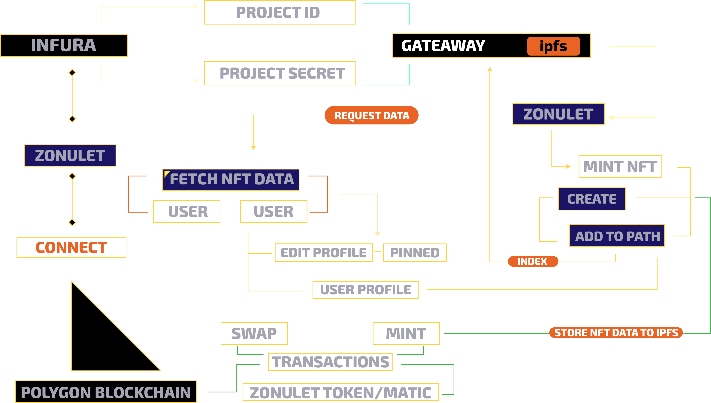

# Best Use of Infura NFT API
## Web App Demo: https://matic.zonulet.io

## See how we use Infura NFT API
- [x] [Mint NFT](https://github.com/Agin-DropDisco/ETH-DENVER-HACK-2023/tree/main/INFURA/Best-Use-of-Infura-NFT-API/client/src/components/mint/mint.js#L754)
- [x] [Create IPFS](https://github.com/Agin-DropDisco/ETH-DENVER-HACK-2023/tree/main/INFURA/Best-Use-of-Infura-NFT-API/client/src/components/mint/mint.js#L762)
- [x] [Adding IPFS Data to Zonulet Path](https://github.com/Agin-DropDisco/ETH-DENVER-HACK-2023/tree/main/INFURA/Best-Use-of-Infura-NFT-API/client/src/components/mint/mint.js#L834)
- [x] [Pinning NFT](https://github.com/Agin-DropDisco/ETH-DENVER-HACK-2023/tree/main/INFURA/Best-Use-of-Infura-NFT-API/client/src/components/mint/mint.js#L853)
- [x] [Fetch NFT Data from Gateaway](https://github.com/Agin-DropDisco/ETH-DENVER-HACK-2023/tree/main/INFURA/Best-Use-of-Infura-NFT-API/client/src/components/explore/exploreall.js#L778)

## Flow

  

